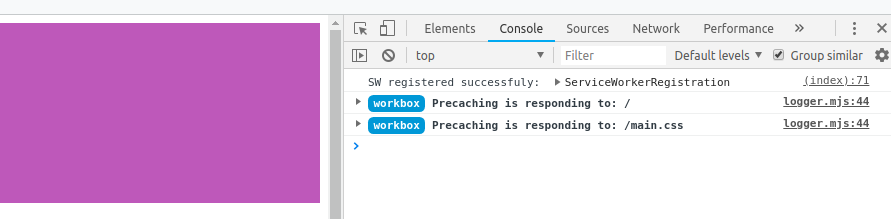
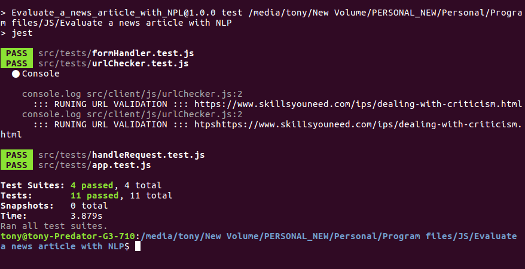
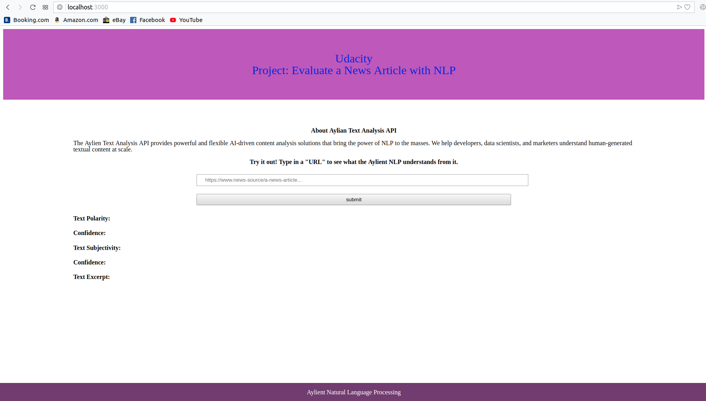
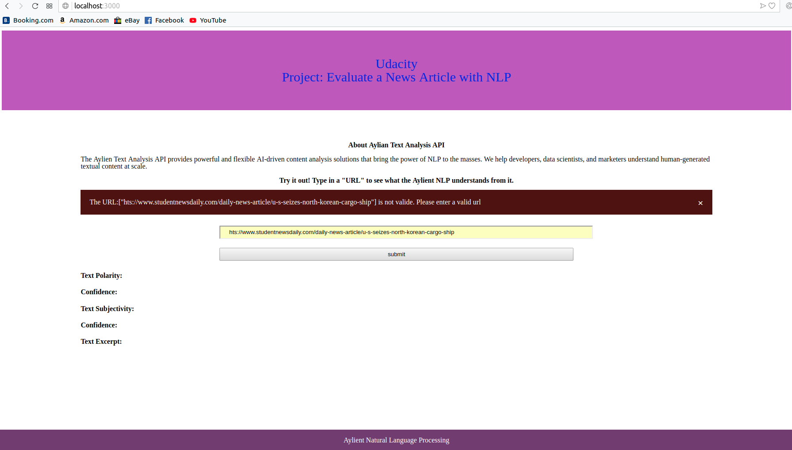
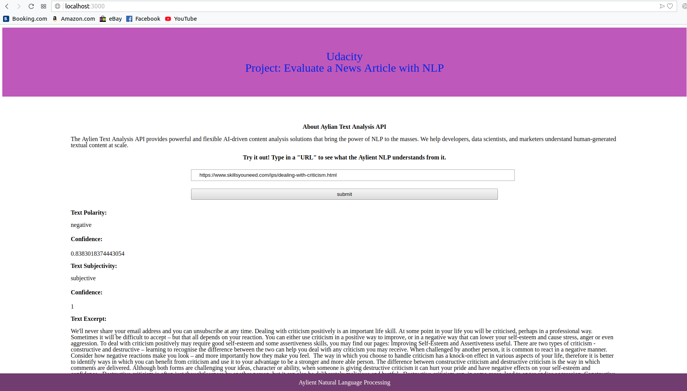

# Udacity Project: 
# Evaluate a news article with Natural Language Processing

## What We will be building

We will be building web tool that allows users to run Natural Language Processing (NLP) on articles or blogs found on other websites. Using an exciting new api called Aylien, we can build a simple web interface to interact with their NLP system. This tool will give us back pertinent information about the article, like whether the content is subjective (opinion) or objective (fact-based) and whether it is positive, neutral, or negative in tone.

Node and express will be the webserver and routing, and webpack will be our build tool of choice. Using webpack, we will set up the app to have development and production environments, each with their own set of tools and commands.

We will also use Jest to test our route and other JavaScript functions of our application

## Run project
Below shows how to run in development and production mode.
### run in development mode
To start the webpack dev server at port 8080

` $ npm run build-dev`

### run in production mode
Generate the dist files and then start server at port 3000

` $ npm run build-prod`

` $ npm run start`

## Configs
Here, we have two webpack config files for both development mode(`webpack.config.dev.js`) and production mode(`webpack.config.prod.js` )

We also have a `package.json` to manage dependencies

## API

The project uses the Text Analysis SDKs from [aylien](https://aylien.com/text-api/sdks/), which provides a powerful and flexible AI-driven content analysis solutions.

## Offline Functionality
The project have service workers set up in webpack to provide the offline functionality of our app. When the service worker is functioning correctly, you will see the below message when you inspect the browser.

## Testing

Testing is done with Jest. To run test, use the command 

`npm run test`. 

## Interactions

### Home page

It is a single page web app. It has a single form input field that accepts user input(URL), then runs a check to make sure it is a valid URL. If it is not a valid URL, the following message will be displayed;

### Invalid URL message

If the URL is valid, an api call will be initiated and the result displayed on the web page as shown below;

### API response

The page built for this project is a simple one. It has a form with a single filed which receives an input. This input is checked for valid url. A helpful error message is displayed for invalid url. If the url is valid, then an api call is performed and the result displayed on the page.

